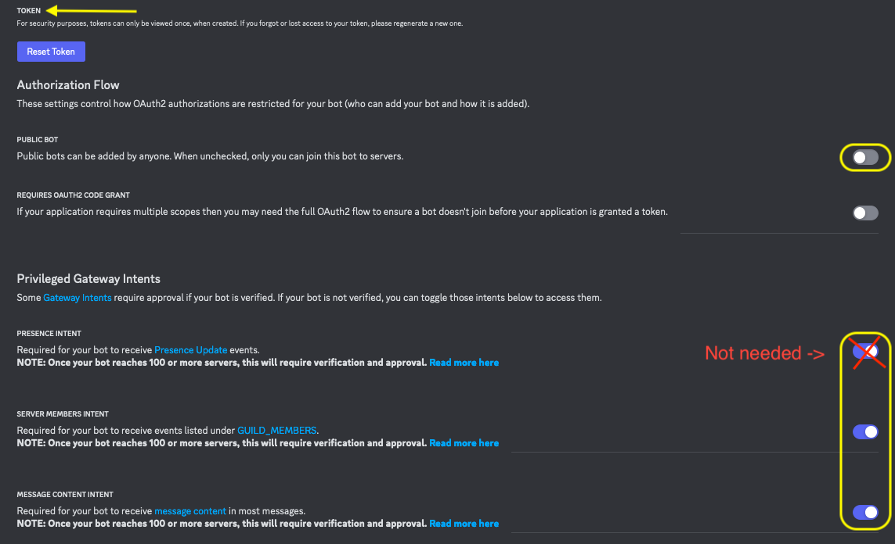
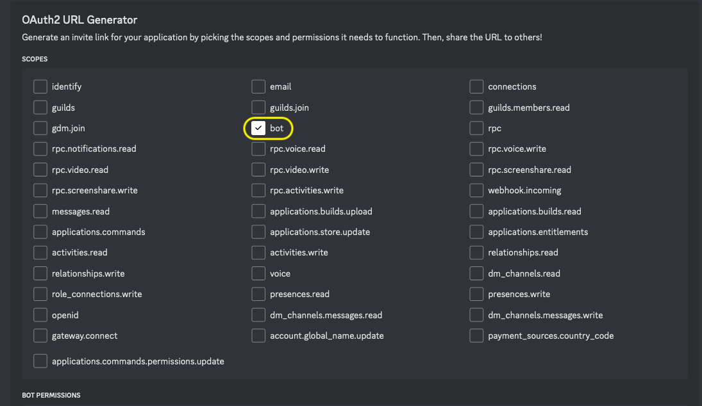
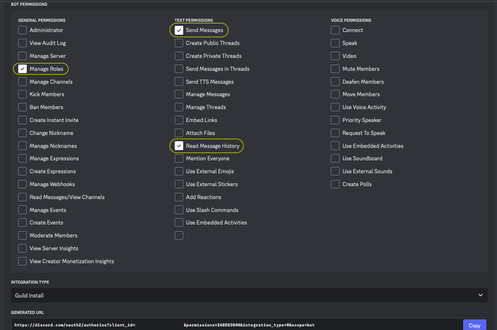

# Autoroles integration for WoWChat/AscensionChat

This script integrates with WoWChat/AscensionChat to automatically assign roles to Discord server members based on their character names mentioned in the chat.

### 📜 How it Works

The script uses the `discord.py` library to interact with the Discord API. It sends a `?who` command to the specified channel, which triggers the WoWChat/AscensionChat bot to respond with a list of character names. The script then extracts the character names using regular expressions (regex) and assigns the specified role to Discord server members with matching names. It will then continue to monitor the specified channel while running. If anyone sends a `?who` command, this bot will once again parse the response and assign roles to those without the role already.

## 💡 Setup

### Create the Discord Bot

1. Go to the [**Discord Developer Portal**](https://discord.com/developers/applications) and create a new app/bot
2. Click the `Bot` tab on the left side.
3. Copy your bot `TOKEN`. _(You might need to reset it first)_
4. Disable `Public Bot`.
5. Under `Privileged Gateway Intents`, enable `Server Members Intent` and `Message Content Intent`.

<details>
<summary>Intents Example Image</summary>

</details>

6. To skip steps 7-9:

   - Copy this link, making sure to replace `YOUR_CLIENT_ID` with your bot's client ID. Open the link in your browser to invite the bot.

     ```https
     https://discord.com/oauth2/authorize?client_id=YOUR_CLIENT_ID&permissions=268503040&integration_type=0&scope=bot
     ```

7. Go to the `OAuth2` tab and select `bot` under `OAuth2 URL Generator -> Scopes`

### OAuth2

8. Underneath `Scopes` in `Bot Permissions` select: `Manage Roles`, `Send Messages` and `Read Message History`.

<details>
<summary>oAuth2 Example Image</summary>

</details>

### Permissions

9. Copy the generated URL and open it in a browser. You can now invite the bot to your Discord Server.

<details>
<summary>Bot Perms Example Image</summary>

</details>

## 💻 Dependencies

### Install Required Packages

1. Install [**Python**](https://www.python.org/downloads/), if you don't have it installed already.
2. Go to [**Installing discord.py**](https://discordpy.readthedocs.io/en/stable/intro.html#installing). Follow the instructions to install the `discord.py` library/module required to run this script.

## 🛠️ Configuration

### Configure the Script

1. Open `wowchat_autoroles.py` in your favorite text editor.
2. Replace `YOUR_TOKEN` with your Discord bot token.
3. Replace `YourServerId` with your Discord server ID.
4. Replace `YourChannelId` with the ID of the channel where this bot will listen for the `?who` command.
5. Replace `YourRole` with the name of the role you want the bot to assign.
6. Replace `YourWowChatBot` with the name of your WoWChat/AscensionChat bot. _(your bot that replies to the `?who` command)_

## 🚀 Run

### Run the Script

1. Save the changes to `wowchat_autoroles.py`.
2. `cd` into the directory you saved `wowchat_autoroles.py` to. (eg, `cd ~/Downloads/wowchat-autoroles`)
3. Run the script using Python:
   - Linux/MacOS: `python3 wowchat_autoroles.py`
   - Windows: `python.exe wowchat_autoroles.py`

Note: Make sure to replace the placeholders with your actual values and adjust the script as needed to fit your specific use case.
